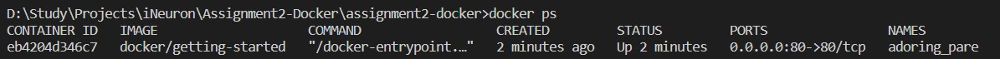
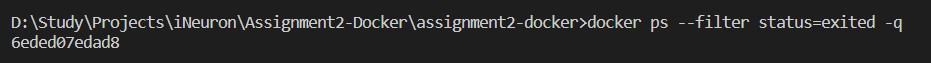
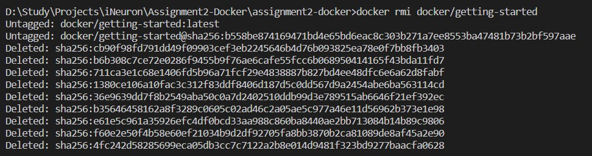
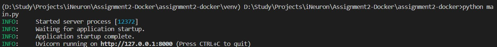

# assignment2-docker
1. Demonstration of basic docker commands.
2. Import Hello World docker image from docker hub and run locally.
3. Create a hello world fastapi application. Create a Dockerfile for your fastapi hello world application. Build Docker image using Docker file. Run docker image built in previous step. Push your Docker image to Docker Hub.
4. Automate docker build and push to hub.

# Task 1 - Basic docker commands
## Import community docker image
Downloading docker image from remote docker hub using the pull command. For example, we'll use "getting-started" docker image.
In order to pull a specific version of that image, we can specify using "docker_image:version_name"
```
docker pull docker/getting-started
```
This command is available at the docker [repository]: https://hub.docker.com/r/docker/getting-started


## View downloaded images
In order to check which images have been downloaded into the localmachine, we can do this.
```
docker images
```


## Run docker image
For a community shared docker image, there usually is a docker run command available at the repository page.
In the following command, -d represents detached mode that means the image will run in the background and not inside the terminal.
-p represents port assignment, which we can assign to the host and the container for communication.
80:80 represents the two port mentioned above, first one is for the host and second one is for the container.
```
docker run -d -p 80:80 docker/getting-started
```
As we specified -d, we don't get any interesting output because the container is running in the background.


## View running containers
In order to see which containers are actually runnning, we can do this.
A local host can have multiple images downloaded and multiple containers running at the same time. Each image corresponds to one container.
```
docker ps
```
Here we can see various container details such as container ID, docker image that created the container, status, ports etc.


## View all containers (running or stopped)
```
docker ps -a
```

## View content inside container 
To see what is actually happening inside the container, we must open a URL with the specific ports mentioned during run command.
In the previous step, we can see that the docker is running on the IP address that matches the local host IP address. 0.0.0.0 signifies that whatever IP is mapped to the local host will be given to the container as well. Therefore, we can use the following URL in a web browser to see inside the container.
```
127.0.0.1:80
```
Here, 80 represents the host port set during the run command.


## Stop container
To stop a running container, the following command can be used
```
docker stop eb4204d346c7
```
Here, the container ID specific to the local host machine is used. Each time the container is run, a different ID is issued to the container and that must be used to stop the container. The ID can be found using the "docker ps" command used previously.
The output simply shows the container ID when the container is stopped successfully.


## Gracefully delete image
To delete a downloaded image from the local machine, its referenced container must be removed first. Although the container was stopped before but still it creates a conflict. Therefore a normal deletion of the image will result in an error.
```
docker rmi docker/getting-started
```


## Force delete image
To force this deletion, use the -f argument.
```
docker rmi -f docker/getting-started
```


## Delete stopped container
To delete the stopped container, we use "rm" to remove the container ID from our list of unused containers.
```
docker ps --filter status=exited -q
```
This shows us the list of stopped containers.

```
docker rm 6eded07edad8
```


Once this is done, we can simply delete the image.


## Remove all
Remove all unused containers, networks, images.
```
docker system prune
```


# Task 2 - Import Hello World docker image from docker hub and run locally.
```
docker pull hello-world
```


```
docker run hello-world
```


# Task 3 - Hello World fastapi application
1. Create a requirements.txt file which contains our required package - fastapi and uvicorn
2. Create a venv with the installed requirements.
```
conda create --prefix ./venv python=3.9
```


```
conda activate ./venv
```
```
conda install --file requirements.txt
```
3. Create a python file which has the code for running our application - main.py.

4. Run the main.py python file to check if the page is loading on loacalhost. Click the http link in the output to open in browser.
```
python main.py
```



use Ctrl + C to quit.


5. Create Dockerfile with the necessary commands:
```
FROM python:3.9
COPY . /app
WORKDIR /app
RUN pip install -r requirements.txt
CMD uvicorn main:app --reload
```

6. Build Dockerfile
```
docker build -t hello-world-app .
```


7. Check the created docker image
```
docker images
```


8. Run the docker image
```
docker run -d -p 8000:8000 hello-world-app
```


Use the following [url](https://127.0.0.1:8000) to see the resulting webpage: https://127.0.0.1:8000

9. Upload this image to docker hub
In order to upload the image to docker hub, you need to create the image using the username for the docker hub account
```
docker build -t pratyushmalik/hello-world-app .
```


10. Upload to hub
To upload this image to docker hub, we have to specify the tag for this build. In case we make changes in the code and build another image later on, we can upload that image to hub again with a different tag/version to specify that it's the same image with modifications.
```
docker push pratyushmalik/hello-world-app:latest
```
